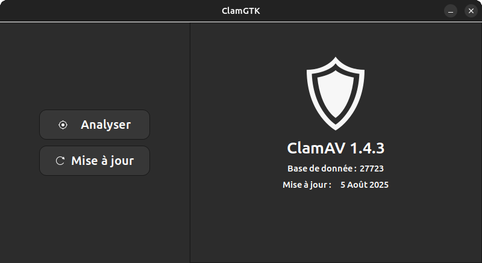

# ClamGTK

Interface graphique pour ClamAV en Gtk3 & libhandy-1



## Installation - Build From Source

### Debian, Ubuntu
```
git clone https://github.com/Gaudrioles/ClamGTK.git
cd ClamGTK
```
```
sudo apt install cmake libgtk-3-dev libhandy-1-dev
```
```
mkdir build
cd build
```
```
cmake ..
make package
```
